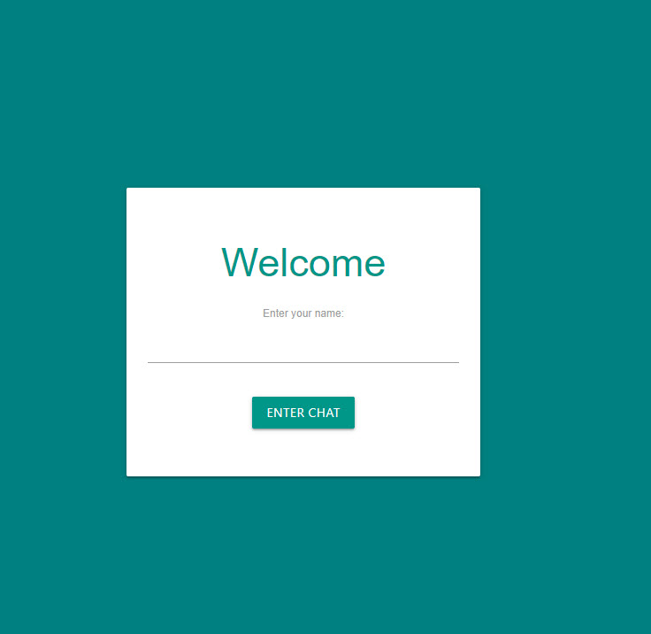

# firebase-chat

## demo website
[demo website](https://fir-chat-a4937.firebaseapp.com/chat)




## Project setup
```
npm install
```

### Compiles and hot-reloads for development
```
npm run serve
```

### Compiles and minifies for production
```
npm run build
```

### Run your tests
```
npm run test
```

### Lints and fixes files
```
npm run lint
```
